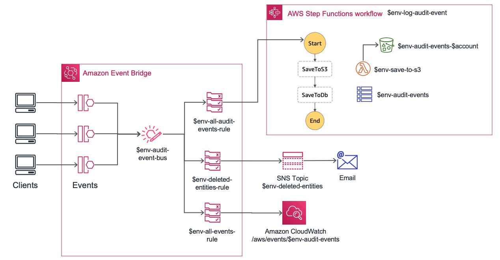

# Audit Service Sample <!-- omit in toc -->

This repository contains a sample audit service where its components are decoupled through the use of [Amazon EventBridge](https://docs.aws.amazon.com/eventbridge/latest/userguide/what-is-amazon-eventbridge.html). When an audit event happens, it is put into a custom bus where different rules evaluate if their corresponding targets should be notified of the event based on the patterns their are interested to.

It uses the [AWS CDK framework](https://docs.aws.amazon.com/cdk/latest/guide/home.html) for defining the required infrastructure while relying on [CDK Pipelines](https://docs.aws.amazon.com/cdk/latest/guide/cdk_pipeline.html) (still on [Developer Preview](https://docs.aws.amazon.com/cdk/api/latest/docs/pipelines-readme.html) as of December 2020) for implementing CI/CD.

**Table of contents:**

- [Architecture](#architecture)
  - [Schema](#schema)
- [Requirements](#requirements)
- [Deployment](#deployment)
- [CI/CD](#cicd)
- [Clean up](#clean-up)

## Architecture

Custom bus defines three rules:

- Rule for audit events (`detail-type='Object State Change'` - See [Schema](#schema) section for more details). These events contain information about changes that are performed over entities in different systems. They are sent to an [AWS Step Function State Machine](https://docs.aws.amazon.com/step-functions/latest/dg/welcome.html) that:
  - Stores the actual entity into an [Amazon S3 bucket](https://docs.aws.amazon.com/AmazonS3/latest/dev/Introduction.html#BasicsBucket) through an [AWS Lambda Function](https://docs.aws.amazon.com/lambda/latest/dg/welcome.html).
  - Saves metadata about the actual change (author, timestamp or type of the operation among others) into an [Amazon DynamoDB table](https://docs.aws.amazon.com/amazondynamodb/latest/developerguide/HowItWorks.CoreComponents.html#HowItWorks.CoreComponents.TablesItemsAttributes) so we can later perform queries to obtain all actions that were taken by a given user or see historical versions of a particular entity.
- Publish a message to an [Amazon SNS topic](https://docs.aws.amazon.com/sns/latest/dg/welcome.html) when an entity is deleted (`detail-type='Object State Change'` and `detail.operation='delete'`). This allows to have other processes notified upon removal actions, such as sending an email to an administrator.
- Log all events going through the bus into an [Amazon CloudWatch Log Group](https://docs.aws.amazon.com/AmazonCloudWatch/latest/logs/CloudWatchLogsConcepts.html) for debugging purposes (could be only for dev/test environments).



NOTE: Although CDK Pipelines offer great help to deploy the same stack to multiple [enviroments](https://docs.aws.amazon.com/cdk/latest/guide/environments.html) (account - region pair), for demo purposes and thus simplicity, this repository assumes only two environments (`staging` and `production`) which live within the same AWS Account.

Given the above, resources are prefixed with the environment they belong to which is just author's preference to keep things tidy in such scenario.

### Schema

Events going through the bus must comply with the following schema:

```javascript
{
  "detail-type": "Object State Change",
  "source": "<system that generated event>",
  "detail": {
    "entity-type": "<entity type in source system>",
    "entity-id": "<entity id in source system>",
    "operation": "insert | update | delete",
    "ts": "<timestamp when change happened (ms)>",
    "author": "<user who triggered the change>",
    "data": {
      // entity body
    }
  }
}
```

There are some sample events in the `events` folder that you can use to manually test resources provisioned by this project:

```sh
aws events put-events --entries file://./events/book-insert.json
```

## Requirements

- Node.js 12.21 ([lts/erbium](https://nodejs.org/en/blog/release/v12.13.0/))
- npm 6
- [AWS CDK Toolkit](https://docs.aws.amazon.com/cdk/latest/guide/cli.html) 1.95.1 or above.
- [AWS CLI](https://docs.aws.amazon.com/cli/latest/userguide/cli-chap-configure.html). You must have run `aws configure` to set up your terminal.

## Deployment

To set up your environment for the first time, run the following commands:

```sh
# create the required parameters in your AWS account so
# AWS CodePipeline can connect to Github and pull source code
aws ssm put-parameter --name github_username --value <YOUR_GITHUB_USERNAME>
aws secretsmanager create-secret --name github_token
aws secretsmanager put-secret-value --secret-id github_token --secret-string '{"github_token": "<YOUR_GITHUB_TOKEN>"}'

# install aws cdk
npm install -g aws-cdk

# install dependencies
npm i

# bootstrap cdk for the target accont and region
# (profile may be different based on your terminal setup)
export ACCOUNT_ID=$(aws sts get-caller-identity --query 'Account' --output text)
export AWS_REGION=$(aws configure get region)

cdk bootstrap aws://$ACCOUNT_ID/$AWS_REGION
```

Then, run the following to deploy the app:

```sh
npm run build
cdk deploy
```

After confirming that there will be security-related changes, the provisioning of the CloudFormation will start. After successful completion, pipeline is automatically triggered. You can go to [AWS CodePipeline](https://docs.aws.amazon.com/codepipeline/latest/userguide/welcome.html) to monitor its progress.

## CI/CD

Pipeline generated by the CDK application contains the following stages:

- **Source**
  - Connects to Github using SSM Parameter and Secret generated as part of [Deployment](#deployment) steps
- **Build**
  - Through npm scripts, we provide a custom command for building our application (`build.sh`):
    - Compile our application from Typescript to ES2018
    - Run [fine-grained assertions](https://docs.aws.amazon.com/cdk/latest/guide/testing.html) to ensure resources generated by our CDK stack meet our requirements
    - As our application contains an AWS Lambda Function, we equally build it and run unit tests to validate behaviour
  - Similarly, synthesize our application once we have removed non-production npm modules (`synth.sh`)
- **Update Pipeline**
  - Stage provided by CDK pipelines which modifies the pipeline in case its definition has changed as part of the last changes
- **Assets**
  - Stage provided by CDK pipelines that prepares and publishes our lambda function assets to Amazon S3.
- **Staging**
  - Deploy CDK application to staging environment
  - Once provisioned, it runs a suite of end-to-end tests in this environment using [AWS CodeBuild](https://docs.aws.amazon.com/codebuild/latest/userguide/welcome.html). Their goal is to ensure that given a input (an event on the bus in our case), we obtain the expected output (logs in CloudWatch, object in S3 bucket or new row in DynamoDB)
- **Production**
  - Before doing the actual deployment to this environment, we add a _Manual Approval_ action after having generated the corresponding [Amazon CloudFormation Change set](https://docs.aws.amazon.com/AWSCloudFormation/latest/UserGuide/using-cfn-updating-stacks-changesets.html), so we can validate that those changes is what we expect to deploy to production

NOTE: You can find further information about CDK Pipelines in this [post](https://aws.amazon.com/blogs/developer/cdk-pipelines-continuous-delivery-for-aws-cdk-applications/) of our [AWS Developer Blog](https://aws.amazon.com/blogs/developer/) where some areas are covered in more detail such as deploying the app to different accounts and regions.

## Clean up

Run the following command in your terminal to destroy the pipeline stack:

```bash
cdk destroy
```

Then, remove stacks for each environment through:

```bash
aws cloudformation delete-stack --stack--name Staging-AuditService
aws cloudformation delete-stack --stack--name Production-AuditService
```

Be aware some resources will not be removed as part of the deletion operation and they will have to be deleted manually: DynamoDB table, S3 bucket and CloudWatch log group.

## Want to contribute? <!-- omit in toc -->

Check our [contribution guidelines](CONTRIBUTING.md) before submitting a pull request. Any contribution must be done to the `develop` branch.

## Security <!-- omit in toc -->

See [CONTRIBUTING](CONTRIBUTING.md#security-issue-notifications) for more information.

## License <!-- omit in toc -->

This library is licensed under the MIT-0 License. See the [LICENSE](LICENSE.md) file.
